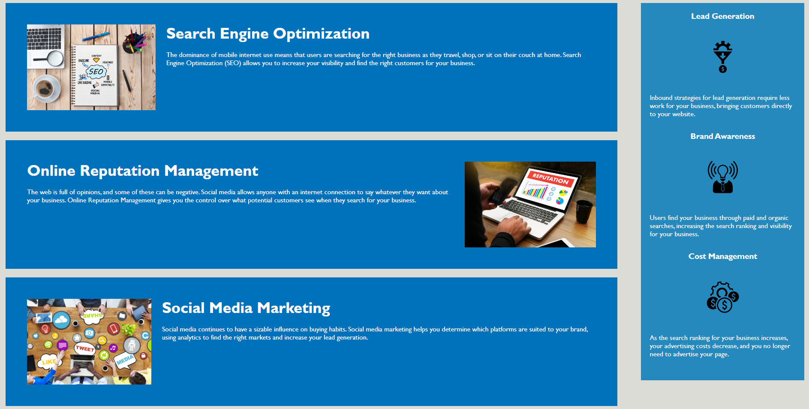

# Module-1-Challenge

# Horiseon SEO Marketing Agency - Code Refactoring Challenge

## Description

I was tasked with putting myself in the shoes of a junior developer who needed to refactor the code for Horiseon's website.
The original HTML code contained several examples of non-semantic elements and was lacking a title. The CSS was repetitive and almost 200 lines.
This task was designed to prepare me for scenarios I may encounter in the real world as a developer and as such can be applied to several real-world tasks.
I learned how to consolidate code, cut out useless classes/IDs and streamline the overall website. I also learned about semantic elements in HTML which are becoming the standard.

## Installation

Please visit this URL to see how the website looks now: https://halcyonlegion.github.io/Module-1-Challenge/

## Usage

Once you load the website you are able to right click and use the inspector tool to go over the new html code.

I updated a div element which had the class of header to just the header element, I also added a nav, the result is:

    
I updated the divs in the middle of the page to sections and an aside, I cut out a lot of unnecessary classes and IDs and consolidated the CSS. The result is:

    
I updated a div with the class of footer at the bottom of the page. Renamed it to purely be a footer element. The result is:

    
## Credits

I learned about semantic vs non-semantic elements here: https://www.w3schools.com/html/html5_semantic_elements.asp

The University of Birmingham provided the materials and guides I used to get this started: https://www.birmingham.ac.uk/index.aspx 

## License

There is no license specified for this project.

---
